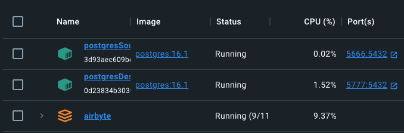
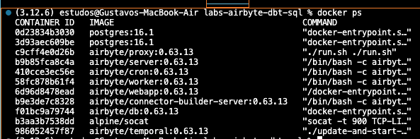
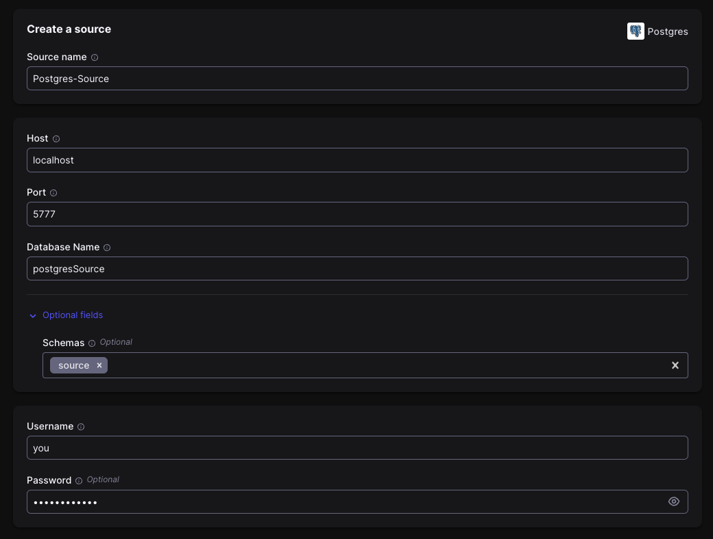
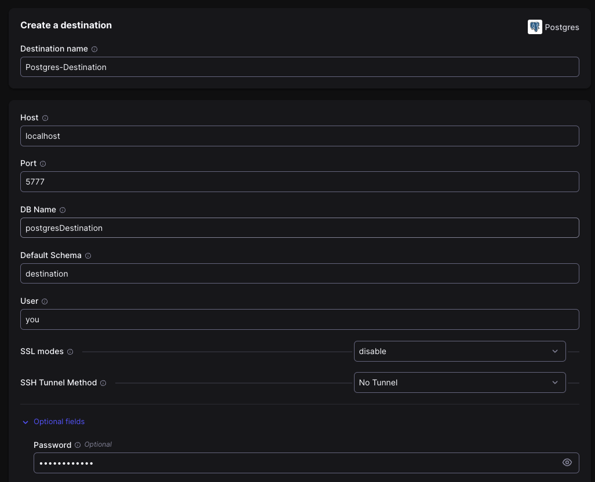
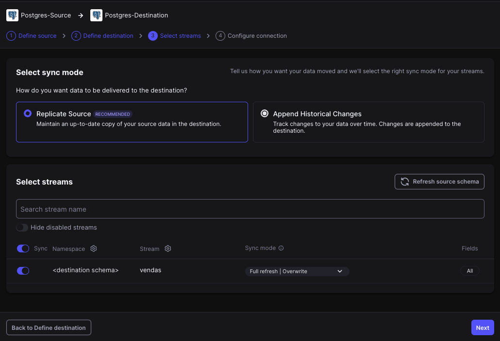

# LAB 1 - Creating a simple connection between two PostgreSQL's Databases

------------

**Step 1:** Create the source database 

    docker run -d --name postgresSource -p 5666:5432 -e POSTGRES_DB=postgresSource -e POSTGRES_USER=you -e POSTGRES_PASSWORD=yourpassword postgres:16.1

Create a server and connect the database with *PGAdmin* and execute the queries described in `create_source.sql` file.

<b></b>
<b></b>

**Step 2:** Create the destination database:

    docker run -d --name postgresDestination -p 5777:5432 -e POSTGRES_DB=postgresDestination -e POSTGRES_USER=you -e POSTGRES_PASSWORD=yourpassword postgres:16.1
<b></b>
<b></b>

**Step 3:** After completing these two steps, you will find both containers in your Docker Desktop, with the Airbyte container already running:

  

You can also verify in the terminal using the command `docker ps`

  

After configuring the tools, you can create the Source and Destination in Airbyte by accessing the localhost on port 8000.

<b></b>
<b></b>

**Step 4:** Creating a Airbyte Source

By accessing the Airbyte console, select the Sources option and click *New Source* to configure your Postgres database source. Search for the *postgres connector* and start your configure to create a source.

  

Keep the default options in *Security*, but in the menu *Advanced* change the update method for "Scan changes with user defined cursor" and press the n *Set up Source* button.

<b></b>
<b></b>

**Step 5:** Creating a Airbyte Destination

In the same way you created the Source, you can now create the Destination, go to the *Destination* option in the console and press *New Destination* button.

After this, search for the *Postgres connector* and begin your configuration.

  

*NOTE:* Click on *Optional fields* to insert your Postgres database password.

<b></b>
<b></b>

**Step 6:** Create a Airbyte Connection

To finish the pipeline, press *Connections* and *Start your first connection* in the main menu and initiate the connection between *Source* and *Destination*.

Select your Source and Destination already created and wait for the stream test, after completed the test.

In the *select streams* step, you need to choose the sync mode and select the streams you want to send to destination.

Here, in the sync mode select *replicate source* and in the *select streams* your table created in your postgresSource database called "vendas" will be copied to the destination.

Select *all* in Fields and, in the Sync Mode the option "Full refresh | Overwrite"

  

In the next page, change the schedule to *Manual* and press *Set up connection*