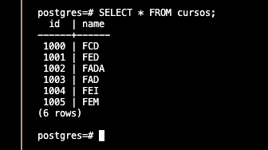

# LAB 2 - Pipeline ELT with Change Data Capture (CDC)

<b></b>
<b></b>

**What is Change Data Capture?**

Change Data Capture is a technique used to capture and identify any changes made in a database, so they can be processed later.

CDC can be used in data integration systems and BI environments, for keep your data syncronized between the sources/destinations.

____

#### Step 1: Deploying a PostgreSQL container with a CDC tool (Debezium)

In this lab, you need to use a CDC tool named [Debezium](https://debezium.io/). This platform will be responsible for converting information from your database into event streams, enabling applications to detect and immediately respond to row-level changes in the databases.

On [Docker Hub](https://hub.docker.com/r/debezium/postgres) we already have a Postgres image with Debezium installed.
To create the container, insert this command in the *Terminal*

    docker run --name postgresSource -e POSTGRES_PASSWORD=yourpassword -p 5439:5432 -d debezium/postgres:16

<b></b>
<b></b>

#### Step 2: Configuring your Postgres database

To access your database without an SGBD like PGAdmin, you can use commands in terminal. First of all, access the container with this command:

    docker exec -it postgresSource /bin/bash

With that, you're in the terminal of the Postgres container. Now, execute the following commands:

 - `psql -U postgres`: Access the database postgres (default)
 - `SET search_path TO postgres`: sets the schema as the default for object searches in the current database session
 - `CREATE SCHEMA postgres`: Create a schema named "postgres"
 - `CREATE USER airbyte PASSWORD 'youpassword'`: Create a user to be used by Airbyte connection
 - `GRANT USAGE ON SCHEMA postgres TO airbyte`: Give permission to user "airbyte" use the schema
 - `GRANT SELECT ON ALL TABLES IN SCHEMA postgres TO airbyte`: Give permission to user "airbyte" make any query in schema's tables
 - `ALTER DEFAULT PRIVILEGES IN SCHEMA postgres GRANT SELECT ON TABLES TO airbyte`: ensures that the airbyte role automatically gets SELECT privileges on all new tables created in the postgres schema
 - `ALTER USER airbyte REPLICATION LOGIN`: The command grants the user replication privileges and enables it to log in

<b></b>
<b></b>

 #### Step 3: Create your table and fill it with data.

 In the next step you need create the table and your data.

 **1. First, create the table with this command:**

        CRATE TABLE cursos(
            id INTEGER,
            NAME VARCHAR(200),
            PRIMARY KEY (id));

**2. fill that with data:**

        INSERT INTO cursos VALUES(1000, 'FCD');
        INSERT INTO cursos VALUES(1001, 'FED');
        INSERT INTO cursos VALUES(1002, 'FADA');
        INSERT INTO cursos VALUES(1003, 'FAD');
        INSERT INTO cursos VALUES(1004, 'FEI');
        INSERT INTO cursos VALUES(1005, 'FEM');

**3. To validate your changes, make a `SELECT * FROM cursos;` to visualize the table:**

  

<b></b>
<b></b>

#### Step 4. Create the Logical Decoding

[Logical Decoding](https://www.postgresql.org/docs/current/logicaldecoding-explanation.html) refers to a feature that allows you to stream changes (such as INSERT, UPDATE, DELETE) made to the database in a logical format, rather than the physical changes that occur at the storage level. It enables you to capture and replicate row-level changes in a more readable and usable format, which is useful for event-driven systems, change data capture (CDC), and replication.

To configure a Logical Decoding, you need to follow these steps:

**1. Create a replication slot**

A replication slot in PostgreSQL is a mechanism that allows the database to retain the write-ahead log (WAL) files necessary for replication.
    <b></b>
    <b></b>

*WAL is a pattern to verify the data quality*
    <b></b>
    <b></b>

    SELECT pg_create_logical_replication_slot('airbyte_slot', 'pgoutput');

- `pg_create_logical_replication_slot`: This function creates a logical replication slot, which is used to stream changes (such as inserts, updates, deletes) in a logical format.
- `airbyte_slot`: the name given to the replication slot
- `pgoutput`: This is the output plugin that specifies the format for the replication data (Debezium)